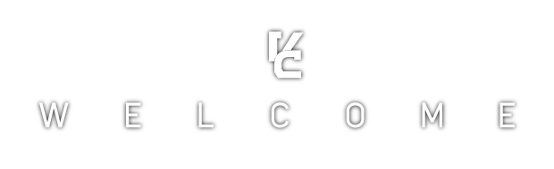

  

# 👋 Hello! I'm **Achmad Firdaus Adinegoro** 
I'm a result-oriented technology professional with proven versatility across web development, machine learning, and graphic design.
Consistently delivers high-quality work on time, demonstrating a strong ability to quickly master new technologies and domains.  

I'm based in **Jakarta, Indonesia**  

<a href="https://me.victim-crasher.com/" target="_blank"></img></a>

# 👩‍💻 Highlighted Projects
🌐 [**Personal Portfolio**](https://github.com/VictimCrasher/irl-web)    - My personal portfolio website, built using **React + Vite + Material UI**.  
🖥 [**Simple Teleprompter**](https://github.com/VictimCrasher/simple-teleprompter)    - A simple teleprompter desktop app, build using **Electron + Vite + React**.  
🎨 [**Inktober Archive**](https://github.com/VictimCrasher/ba-inktober)    - A personal inktober artwork showcase. Built with **Next.js + TypeScript + Material UI**.  
🎥 [**DaMovieDB**](https://github.com/VictimCrasher/vic-movies)    - A movie database, built using **React + TypeScript + Vite** with **Material UI, Firebase Auth, i18n, and Jotai**.  

# 💻 Tech Stack
- 🖥 Web Development
- ✨ AI
- 🎨 Graphic Design and Art

                                    

# 📞 Contacts
Feel free to hit me up on:  
👨 [**LinkedIn**](https://www.linkedin.com/in/achmadfirdausadinegoro/)  
📧 [**Email**](achmadfirdausadinegoro@gmail.com)  
🎥 [**YouTube**](https://www.youtube.com/@Victim_Crasher)
